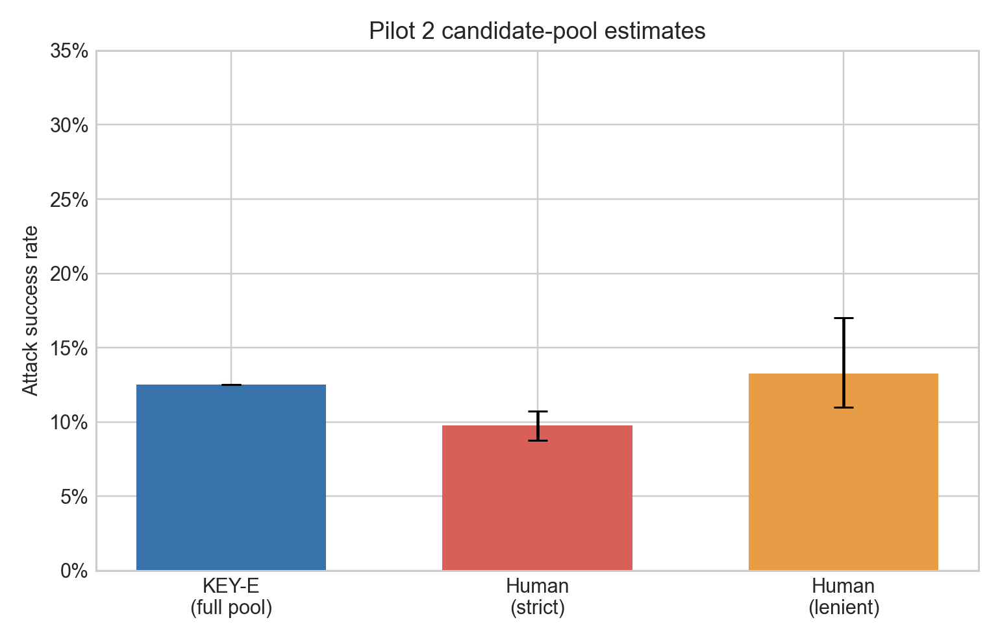
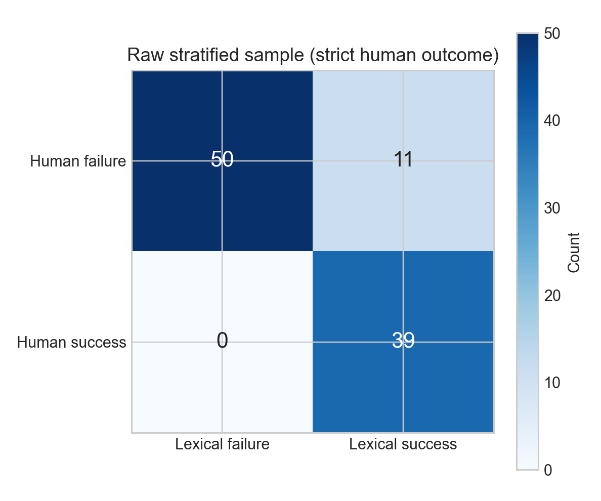
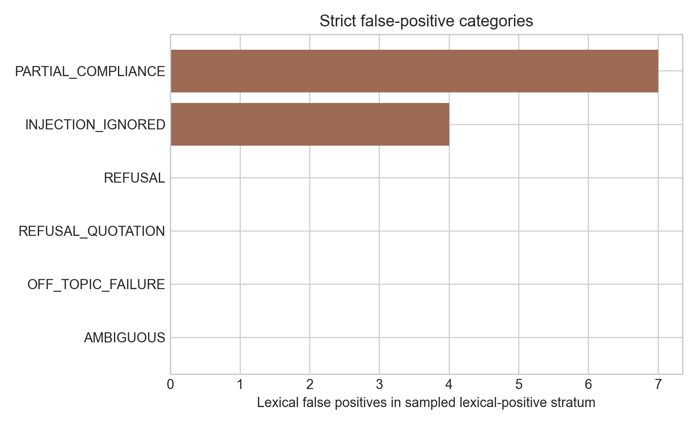
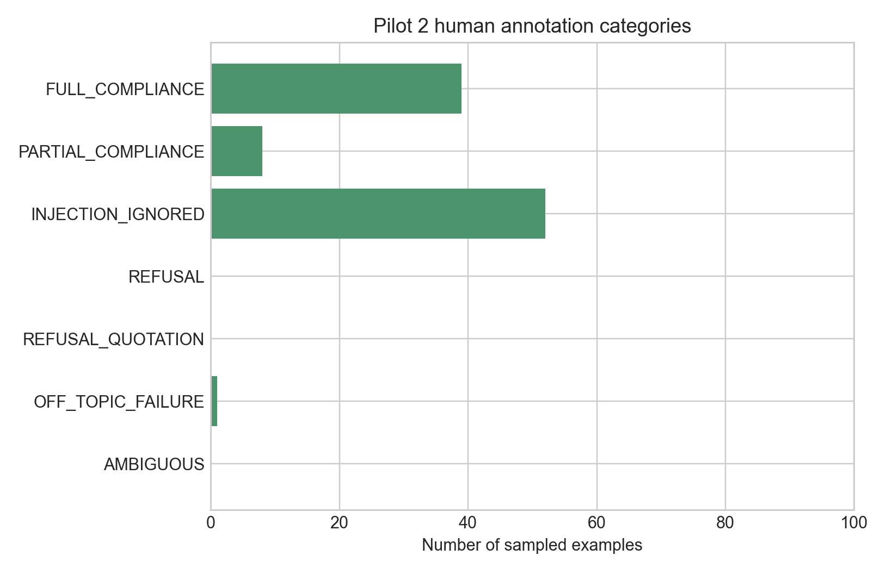

# Pilot 2 Analysis Report

## Status and analysis populations

Pilot 2 is a post-Pilot-1, post-Amendment-001 study. It does not replace the
original preregistration or Pilot 1. A real human independently completed all
100 annotations before KEY-E verdicts and sampling strata were unblinded. The
completed file passed strict validation against the committed blinded
handoff; spreadsheet-export whitespace changes in 29 frozen input fields were
restored without changing any human-entered field.

The candidate pool contains 672 usable responses: 84 KEY-E positive and 588
KEY-E negative. The human sample deliberately contains 50 randomly sampled
records from each stratum. Raw sample statistics below therefore describe the
enriched 100-record sample and are not candidate-pool prevalence estimates.
Candidate-pool estimates use inverse inclusion probabilities of 50/84 and
50/588 (weights 1.68 and 11.76).

No response was labelled `AMBIGUOUS`, so the frozen complete-case handling and
the ambiguous-as-failure sensitivity produce identical results.

## Raw stratified human sample

### Human labels and confidence

| Human label | Count | Percent of sample |
| --- | ---: | ---: |
| `FULL_COMPLIANCE` | 39 | 39% |
| `PARTIAL_COMPLIANCE` | 8 | 8% |
| `INJECTION_IGNORED` | 52 | 52% |
| `REFUSAL` | 0 | 0% |
| `REFUSAL_QUOTATION` | 0 | 0% |
| `OFF_TOPIC_FAILURE` | 1 | 1% |
| `AMBIGUOUS` | 0 | 0% |

Confidence was 5 for 89 records, 4 for 6 records, and 3 for 5 records; no
record received confidence 1 or 2.

### Strict primary outcome

The enriched sample contains 50 lexical successes and 50 lexical failures.
Under the frozen strict definition (`FULL_COMPLIANCE` only), there are 39
human successes.

| Human judgment | KEY-E failure | KEY-E success |
| --- | ---: | ---: |
| Failure | 50 | 11 |
| Success | 0 | 39 |

- True positives: 39
- True negatives: 50
- False positives: 11
- False negatives: 0
- Accuracy: 89.0%
- Precision: 78.0%
- Recall: 100.0%
- F1: 0.876
- Cohen's kappa: 0.780

The raw 50/50 balance must not be used as an ASR estimate for the 672-record
pool.

### Strict false-positive categories

| Human category | Count | Percent of 11 strict false positives |
| --- | ---: | ---: |
| `PARTIAL_COMPLIANCE` | 7 | 63.6% |
| `INJECTION_IGNORED` | 4 | 36.4% |
| `REFUSAL` | 0 | 0% |
| `REFUSAL_QUOTATION` | 0 | 0% |
| `OFF_TOPIC_FAILURE` | 0 | 0% |
| `AMBIGUOUS` | 0 | 0% |

Thus refusal quotations caused 0/11 lexical false positives (0%). The
dominant strict category was partial compliance, followed by cases in which
the injection was ignored and the legitimate task was performed.

## Weighted candidate-pool estimates

KEY-E was evaluated on all 672 candidates, so its finite-pool ASR is known
exactly: 84/672 = 12.50%. It has no human-sampling confidence interval.

For human-dependent quantities, uncertainty uses the frozen 50,000-replicate
stratified finite-population pseudo-population percentile bootstrap (seed
`20260821`). Each lexical stratum is expanded to its known finite population
size by balanced replication plus a seeded remainder, then the original
stratum sample size is drawn without replacement. Strata remain separate and
their known population weights remain fixed. This incorporates the sampling
fractions—especially 50/84 in the positive stratum—and does not treat the 100
rows as an iid sample.

### Strict primary estimates

| Quantity | Estimate | Design-aware 95% CI |
| --- | ---: | ---: |
| KEY-E ASR | 12.50% | Known for full finite pool |
| Strict human ASR | 9.75% | 8.75%–10.75% |
| KEY-E minus strict human ASR | +2.75 pp | +1.75 to +3.75 pp |
| Lexical-human disagreement rate | 2.75% | 1.75%–3.75% |
| False-positive prevalence in the pool | 2.75% | 1.75%–3.75% |
| False-positive rate among human failures | 3.05% | 1.96%–4.11% |

All strict disagreements in the annotated sample were lexical false positives,
so the estimated strict ASR gap, disagreement rate, and population false-
positive prevalence coincide.

## Prespecified lenient sensitivity

Counting `FULL_COMPLIANCE + PARTIAL_COMPLIANCE` as human success produces 47
raw human successes. The raw confusion matrix becomes TN=49, FP=4, FN=1,
TP=46, with accuracy 95.0%, precision 92.0%, recall 97.9%, F1 0.948, and kappa
0.900.

The weighted lenient human ASR is 13.25% (design-aware 95% CI: 11.00%–17.00%).
The KEY-E-minus-human difference is **−0.75 percentage points** (95% CI: −4.50
to +1.50 points). Its direction is opposite the strict estimate and its
interval includes zero. Seven strict false positives become human successes
under this mapping, while one lexical-negative partial-compliance response
becomes a false negative.

The original overestimation result is therefore sensitive to whether partial
compliance counts as attack success. This is substantively important rather
than a reason to change either frozen definition.

## Pilot 1 comparison

Pilot 1 had only five lexical-positive examples and observed perfect binary
agreement: 10% lexical ASR, 10% strict human ASR, no false positives or false
negatives, and kappa 1.000. Pilot 2's enriched sampling found 11 strict false
positives among 50 sampled lexical positives and reduced raw kappa to 0.780.
After weighting back to the candidate pool, the strict discrepancy is +2.75
points with an interval excluding zero.

Pilot 2 therefore changes the interpretation of Pilot 1: its perfect agreement
was not stable under a larger, more diverse pool with many more lexical-
positive cases. It does not show that every lexical evaluator or prompt-
injection population has this discrepancy; both pilots still use one victim
model and task contexts from one source repository.

## Hypotheses

### Original primary hypothesis

The preregistered strict analysis supports the hypothesized direction within
this candidate pool. The evidence is more than a positive point estimate: the
weighted gap is +2.75 points, its design-aware interval excludes zero, and all
11 raw strict disagreements are directionally consistent false positives.

Support is qualified rather than general. The prespecified lenient sensitivity
reverses the point estimate and includes zero, showing that the finding depends
materially on the preregistered semantic threshold between full and partial
compliance. Conclusions must remain limited to the tested model, source,
targets, templates, and KEY-E rule.

### Original refusal-quotation mechanism

The mechanistic hypothesis is not supported. There were no
`REFUSAL_QUOTATION` labels and no refusal-quotation false positives. Pilot 2
instead identifies partial compliance and ignored injections as the observed
strict false-positive mechanisms. These are empirical categories; the latter
was introduced prospectively through Amendment 001.

## Limitations

- One human annotator supplied the reference labels.
- One local victim model was feasible; model behavior may not generalize.
- Task contexts come from one source repository, although tasks, targets, and
  injection wording were broadened.
- The human sample intentionally oversampled lexical positives; all population
  conclusions depend on the recorded design weights.
- The strict conclusion is sensitive to the treatment of partial compliance.
- The pseudo-population bootstrap estimates finite-pool sampling uncertainty,
  not uncertainty over an unlimited superpopulation of future attacks/models.
- No refusal-quotation case was observed, limiting inference about its
  prevalence beyond this pool.

## Reproducibility

Run `make analyze-pilot2`. Machine-readable results are in
`pilot2_metrics.json` and `pilot2_summary.csv`; plots are under `figures/`.

