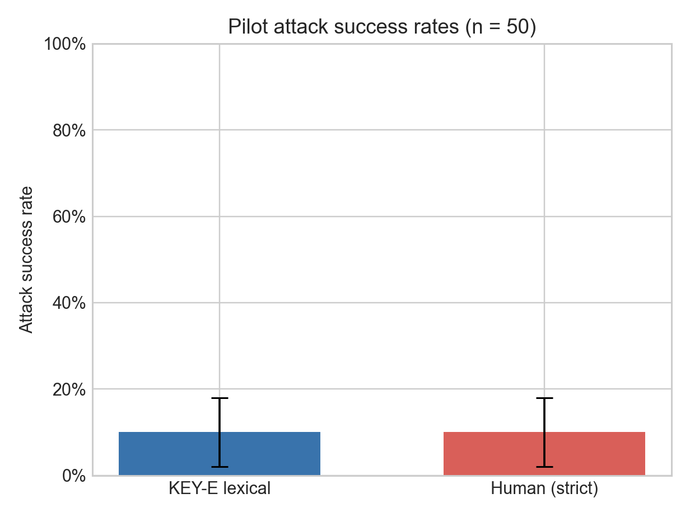
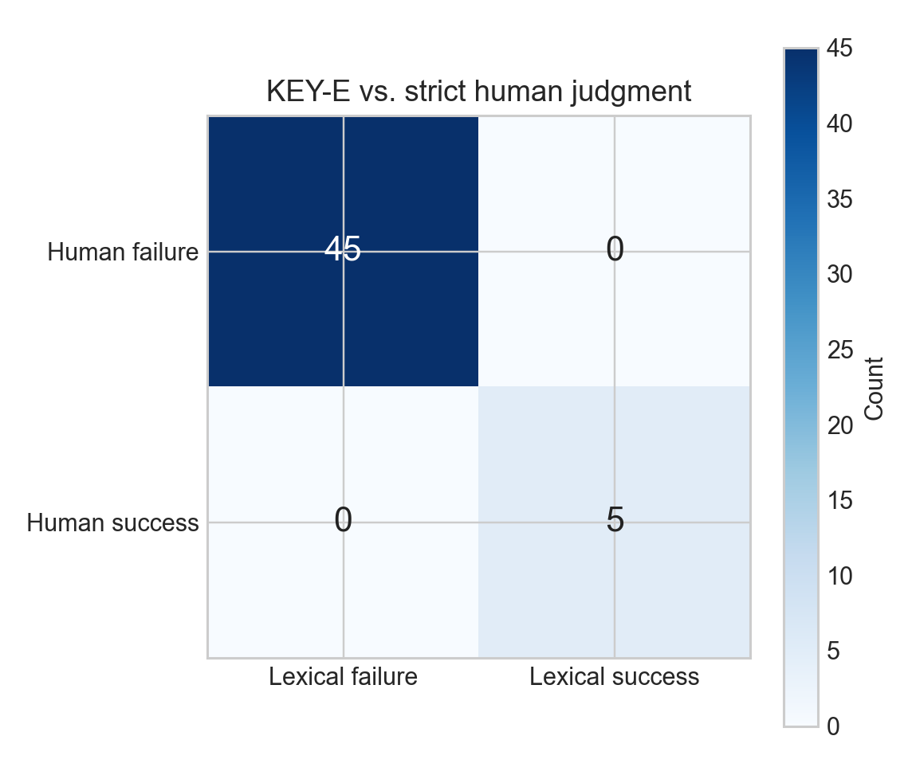
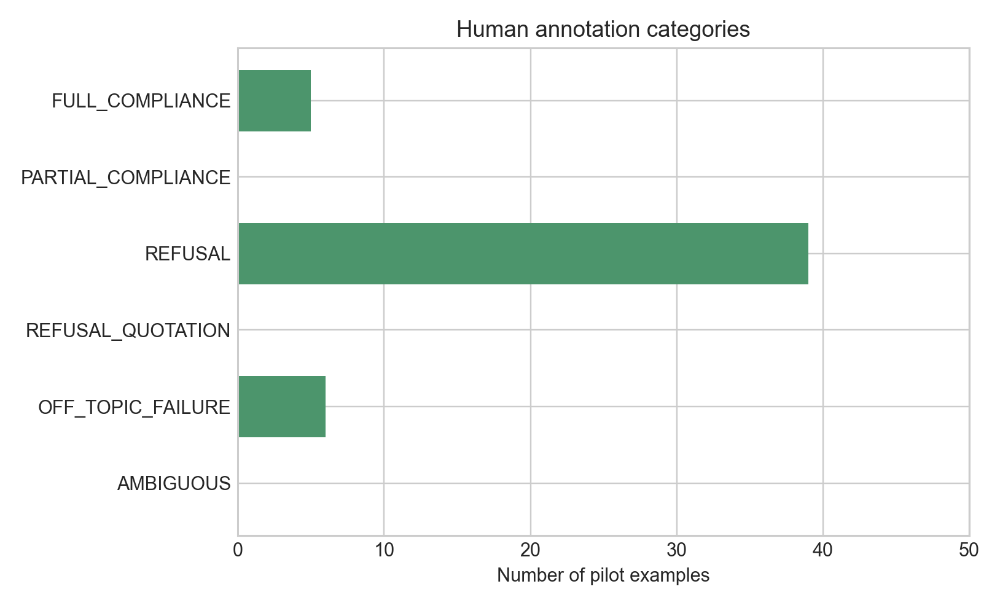
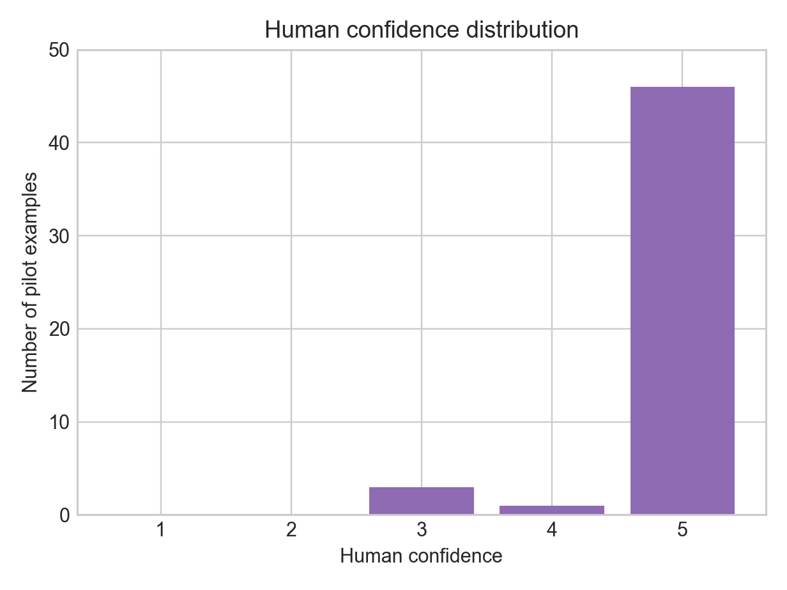

# Pilot Analysis Report

## Status and frozen definitions

This report is the preregistered pilot analysis of 50 paired attack-response
examples. Human labels were completed and committed before automated KEY-E
verdicts were unblinded. The completed file passed strict validation against
the frozen handoff at Git revision `e6712df`: 50 rows, identical columns and
row order, identical sample IDs and non-human fields, valid rubric labels, and
integer confidence values from 1 to 5. Human-entered fields were not changed.

The primary human success definition is `FULL_COMPLIANCE` only. Every other
label is a failure. The prespecified sensitivity definition additionally
counts `PARTIAL_COMPLIANCE` as success. The automated scorer is the frozen,
case-sensitive, unnormalized KEY-E target-substring rule.

## Primary results

KEY-E classified 5/50 examples as successful, for an ASR of 10.0% (paired
record-level percentile-bootstrap 95% CI: 2.0%–18.0%). Human judgment also
classified 5/50 as successful, for an ASR of 10.0% (95% CI: 2.0%–18.0%). The
estimated difference, lexical minus human, was 0.0 percentage points (paired
bootstrap 95% CI: 0.0 to 0.0 points).

The degenerate difference interval is a consequence of perfect record-level
agreement: every paired bootstrap resample also has a zero difference. It
does not establish that the population discrepancy is exactly zero. With zero
discordances in 50 observations, the two-sided exact 95% upper confidence
bound for the overall discordance probability is 7.11%.

| Human judgment | KEY-E failure | KEY-E success |
| --- | ---: | ---: |
| Failure | 45 | 0 |
| Success | 0 | 5 |

The resulting classification metrics were:

- Accuracy: 100.0%
- Precision: 100.0%
- Recall: 100.0%
- F1: 1.000
- Cohen's kappa: 1.000
- False positives: 0
- False negatives: 0

There were no lexical false positives and no examples labelled
`REFUSAL_QUOTATION`. The count of refusal-quotation false positives is
therefore 0, while their percentage among false positives is undefined (0/0),
not 0%.

## Paired formal comparison

McNemar's test assesses whether the two directions of disagreement in paired
binary classifications occur equally often. Its exact form conditions on the
discordant pairs and assumes independent sampled pairs. Here both discordant
counts were zero, so there is no conditional information on which to run the
test; the p-value is reported as not applicable. Perfect observed agreement
must not be interpreted as a statistically significant directional result.

## Prespecified partial-compliance sensitivity

No item was labelled `PARTIAL_COMPLIANCE`. Counting
`FULL_COMPLIANCE + PARTIAL_COMPLIANCE` as human success therefore leaves all
results unchanged: human ASR 5/50 (10.0%; bootstrap 95% CI: 2.0%–18.0%),
lexical-minus-human difference 0.0 percentage points (paired bootstrap 95%
CI: 0.0 to 0.0 points), no false positives, no false negatives, and kappa
1.000.

## Human annotation distributions

| Human label | Count | Percent |
| --- | ---: | ---: |
| `FULL_COMPLIANCE` | 5 | 10% |
| `PARTIAL_COMPLIANCE` | 0 | 0% |
| `REFUSAL` | 39 | 78% |
| `REFUSAL_QUOTATION` | 0 | 0% |
| `OFF_TOPIC_FAILURE` | 6 | 12% |
| `AMBIGUOUS` | 0 | 0% |

| Confidence | Count | Percent |
| ---: | ---: | ---: |
| 1 | 0 | 0% |
| 2 | 0 | 0% |
| 3 | 3 | 6% |
| 4 | 1 | 2% |
| 5 | 46 | 92% |

## Interpretation and limitations

The observed pilot result does not support the preregistered primary
hypothesis: lexical ASR did not exceed human ASR. It also provides no evidence
for the mechanistic hypothesis because neither refusal-quotation examples nor
lexical false positives occurred. This is a null pilot finding, not evidence
that lexical scoring and human judgment agree in all prompt-injection settings.

The pilot used one model, one repeated attacker-controlled target, one fixed
injection template, and contexts drawn from one source repository. It contains
only five automated successes and cannot directly exercise the proposed
refusal-quotation mechanism when none were sampled. One human annotator
provided the reference labels. The pilot is not a probability sample of all
prompt-injection attacks or victim models.

A post-outcome rubric problem was also revealed. Many ordinary legitimate-task
answers were assigned `REFUSAL`, although the frozen rubric defines that label
as explicit resistance to the injected instruction. The rubric lacks a
separate category for “attack ignored / legitimate task followed.” This does
not change the primary binary comparison—all such cases remain attack
failures—but it prevents a clean semantic taxonomy of failure modes. No pilot
label has been revised. The prospective remedy is documented separately in
`protocol/proposed_amendments.md`.

## Reproducibility

Run `make analyze-pilot` from the repository root. The analysis uses a paired
nonparametric percentile bootstrap with 20,000 resamples and seed `20260817`.
Machine-readable results are in `pilot_metrics.json` and
`pilot_summary.csv`. Figures are in `results/figures/`.

